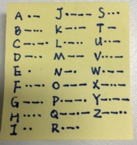

#### 摩斯密码



尽管摩尔斯电码与计算机毫不相关，但熟悉它的本质却对深入了解计算机内部语言和软硬件的内部结构有很大的帮助。
在《百年孤独》的一书的开篇，马尔克斯回忆了一个时代，那时“世界一片混沌，许多事物没有名字。为了加以区别才给事物各个命名。

几乎所有人都知道一点儿摩尔斯电码，国际遇险信号S O S的摩尔斯电码为“三点三划三点”。S O S并非缩写，选择它仅仅因为它有一个易记的摩尔斯电码序列。
第二次世界大战中，英国广播公司选用贝多芬第五交响曲中的片段作为节目前奏— B A H 、B A H 、B A H 、B A H M M M M M，听起来颇像摩尔斯电码中V
（代表Vi c t o r y）的码字。

> 摘自：《编码的奥秘》第二张 编码与组合
> https://book.douban.com/subject/1024570/

摩斯密码中只有点和划两种符号，通过不同的组合编码不同的字符，类似计算机中的0和1，
而且按照点和划的个数编码表可以划分为1个、2个、3个和4个符号组成的字符表，
使用频率越高的字符编码的组合越简单，而且这四张表分别含有2个、4个、8个和16个字符，对应2的1次方，2次方，3次方和4次方，
四张表共包括2 + 4 + 8 + 16 ＝ 3 0个编码，可与3 0个字母相对应，比拉丁字母所需的2 6个字母还多了4个。
出于这个原因，在最后一张表中，你可能注意到有4个编码与重音字母相对应。

在翻译别人发送的摩尔斯电码时，这4张表提供了极大的便利。

为了使译码的过程更为简便，可以画出一张树形图，类似二叉查找树。


#### 逻辑电路

一个开关、一根电线、一个灯泡和一个电池可以组合成电路，如果增加一个开关，那么这就类似一个逻辑与的关系，只有两个开关同时闭合，才会有电流在电路中流动。


同样，也可以构造一个类似逻辑或的电路。


#### 继电器

当有电流在线圈中流动的时候，铁棒会产生磁性并吸引上方的开关使之闭合，形成电磁铁。这就被称作继电器。继电器对电报系统的工作十分重要。
连接电报站的电线长距离时电阻很大，需要一种方法来接收微弱的信号并把它增强后发送出去。继电器通过使用电磁铁控制开关可做到这一点。
事实上，继电器放大了一个很弱的信号使其成为一个强信号。就我们的目的而言，我们并不对它的信号放大能力感兴趣，
真正使我们着迷的是继电器作为开关可用电来控制而不用手指。


正是因为有了继电器的间接触发电路开闭的功能，我们才得以能够构造更加复杂逻辑电路。
下面是两个继电器构造的逻辑与电路：


逻辑与电路可以简化成为这个符号：


#### 逻辑门

与门


输入和输出的对应关系：

```C
AND   0   1
 0    0   0
 1    0   1
```
 
 或门
 


输入和输出的对应关系：

```C
AND   0   1
 0    0   1
 1    1   1
```
 
非门


输入和输出的对应关系：

```C
AND   0   1
      1   0
```

 与非门
 


输入和输出的对应关系：

```C
AND   0   1
 0    1   1
 1    1   0
```

 或非门
 


输入和输出的对应关系：

```C
AND   0   1
 0    1   0
 1    0   0
```
 
