#### 振荡和计数器

继电器输出同时又作为自己输入，做如下连接，只要开关是闭合的，金属簧片就会上下跳动—使电
路闭合或断开—并制造一种声音。如果金属簧片制造了一种刺耳的声音，它就构成了一个
蜂鸣器。如果金属簧片附上一把小锤子，再加一个金属锣，它就构成了一个电铃。

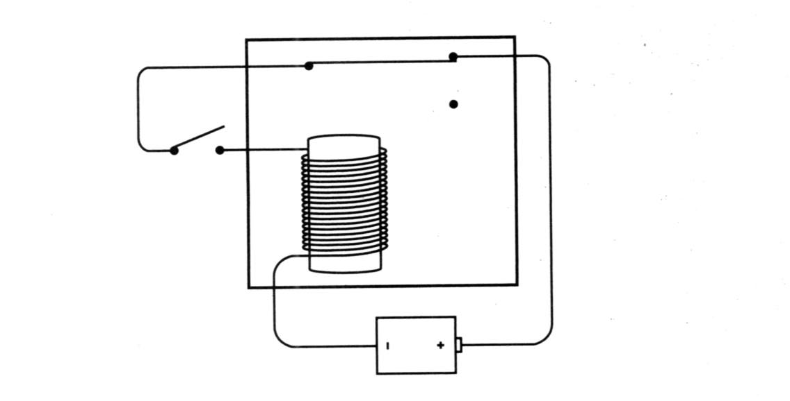

也可以像这样表示：

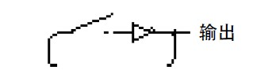

对于反向器而言，当输入为0时，输出为1；输入为1时，输出为0。在该电路中闭合开关
会使反向器中的继电器间断地闭合和断开。如果去掉开关，可以使反向器连续地工作

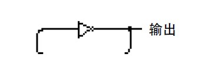

这幅图似乎在演示一种逻辑矛盾，反向器的输出是和其输入相反的，但是在这里，其输
出同时又是其输入。需要特别指出的是，反向器实际上是一个继电器，而继电器从一个状态
转换到另一个状态是需要时间的。所以，即使输入和输出是相等的，输出也会很快地改变，
成为输入的倒置（当然，随即输出也就改变了输入，如此反复）。
电路的输出是什么呢？其实就是提供电压和不提供电压之间的变换。或者说输出要么是0，
要么是1。

这个电路称为`振荡器`，它和我们以前见到的每样东西都有本质上的区别。以前，所有的
电路都靠手动地断开或闭合开关来改变状态，而振荡器却不需要人的干涉，它可以自主地工
作。

当然，单独的一个振荡器不会有什么用，但在本章的后面及接下去的几章里，你会看到
这个电路和其他电路连接后构成了自动控制中一个十分关键的部分。所有计算机都靠某种振
荡器来使其他部件同步工作。

振荡器的输出是0和1的交替序列，可以用下图形象地来表示它：

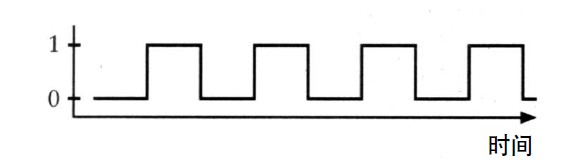

图中，水平轴表示时间，垂直轴表示输出是0或1.

此图表示随着时间的变化，振荡器的输出在0和1之间交替变化。基于这个原因，振荡器
有时称为时钟（c l o c k），因为通过对振荡次数记数还可确定时间。

那么，振荡器运行的速度有多快呢？也就是说，金属簧片上下跳动的频率是多少？每秒
有多少次呢？很明显，这依赖于继电器是如何构造的。容易想到，一个大的、笨重的继电器
只能迟钝地上下摆动；而一个小的、轻巧的继电器可以迅速地跳动。
我们把振荡器从某个时间的输出开始，经历一段变化又回到同样输出的这一段间隔称为
振荡器的一个循环（c y c l e）：

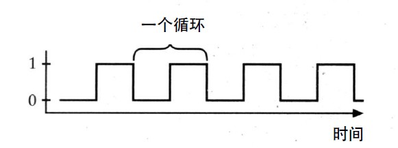

一个循环所需要的时间称为振荡器的周期。假设一个振荡器的周期是0 . 0 5秒，则可以在水
平轴上标出时间：

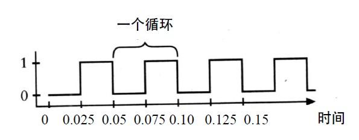

振荡器的频率是周期的倒数。本例中，若振荡器的周期是0 . 0 5秒，则其频率是1÷0 . 0 5秒，
即每秒钟2 0个循环。这表明振荡器的输出每秒钟改变2 0次。我们可以说这个振荡器的频率是2 0赫兹，或直接简写为2 0 H z。

到目前为止，我们只是在假设一个振荡器的速度。到本章末尾，我们可以构造一种器件
来真正地测量一个振荡器的速度。
为了构造这个器件，先看一个用特殊方式连接的一对或非门。或非门的特点是只有两个
输入都为0时，输出才为1：

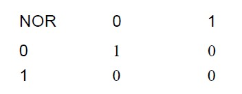

下图是含有两个或非门、两个开关和一个灯泡的电路：

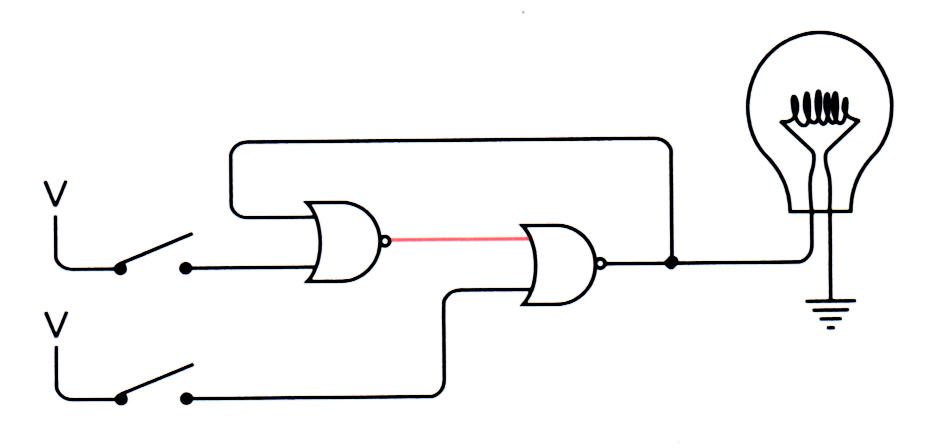

注意图中奇特的连接方式：左边或非门的输出是右边或非门的输入，右边或非门的输出是左
边或非门的输入。这是一种反馈。事实上，这和在振荡器中类似，输出又返回作为一种输入。
这是本章中大部分电路的特点。

在上图电路中，一开始，只有左边或非门的输出有电流，因为它的两个输入均为0。现在
闭合上面的开关，左边或非门的输出变为0，于是右边或非门的输出变为1，灯泡点亮

神奇之处在于当你断开上面的开关时，由于或非门的输入中只要有一个为1，其输出就是
0，因而左边或非门的输出不变，灯泡仍然亮着

总结起来就是：
• 闭合上面的开关使灯泡点亮，当再断开时，灯泡仍然亮着。
• 闭合下面的开关使灯泡熄灭，当再断开时，灯泡仍然不亮。

电路的奇特之处是：有时当两个开关都断开时，灯泡亮着；而有时，当两个开关都断开
时，灯泡却不亮。当两个开关都断开时，电路有两个稳定状态，这样的一个电路称为触发器。
触发器是1 9 1 8年在英国射电物理学家William Henry Eccles(1875-1 9 6 6 )和F. W. J o r d a n的工作中
发明的。

触发器电路可以保持信息，换句话说，它有记忆性。它可以“记住”最近一次是哪个开
关先闭合的。如果你遇到这样一个触发器，它的灯泡亮着时，你可以确定最近闭合的是上面
的开关；而灯泡灭着时则是下面的开关。

触发器是十分关键的工具，尽管你现在可能还没看出来。它们赋予电路“记忆”，使其知
道以前曾有过的状态。想像一下，如果你没有记忆力，你该如何去数数，你记不住你刚数过
的数，当然也无法确定下一个数是什么。同样，一个能计数的电路（本章后面要提到）必定
需要触发器。

触发器有很多种，刚才所看到的是最简单的一种，称为R - S（或R e s e t - S e t，复位/置位）
触发器。下面以对称的方式把它重新绘出来：

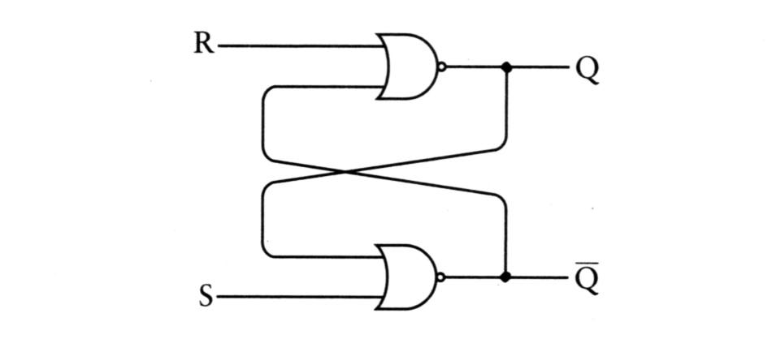

用于点亮灯泡的输出称为Q，另一个输出-Q是Q的倒置。如果Q是0，-Q就是1，反之亦然。
两个输入端S（S e t）和R（R e s e t）分别表示置位和复位。你可以把“置位”理解为把Q设为1，
而“复位”是把Q设为0。当S为1时（对应于前面图中闭合上面开关的情况），Q变为1而-Q变为
0；当R为1时（对应于前面图中闭合下面开关的情况），Q变为0而-Q变为1。当S和R都为0时，
输出保持Q原来的状态。输入与输出的关系小结于下表中：

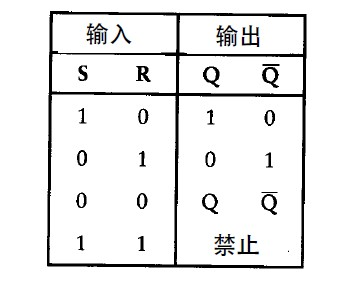

这张表称为功能表、逻辑表或真值表。它指明不同的输入组合能产生不同的输出结果。由于
R - S触发器有两个输入端，因而不同的输入组合有4种，分别对应于表中的4行。

注意表中倒数第2行中S和R均为零，而输出标识为Q和-Q。这表示当S和R输入均为零时，
Q和-Q端的输出保持S、R同时设为0以前的输出值。表中最后一行说明S和R输入都为1是非法
的、禁止的。这是因为S、R同时为1时，两个输出Q和-Q均为零，这与Q和-Q互为倒置的关系相
矛盾。所以，当你用R - S触发器设计电路时，要避免使R、S输入同时为1的情况。

R - S触发器通常画成有两个输入，两个输出的方块图，如下图所示：

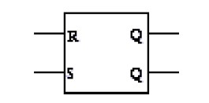

R - S触发器能够记住哪一个输入端最近被输入高电位，这确实很有趣。但更有用的电路应
该能记住某个特定时间点上上一个信号是0还是1。

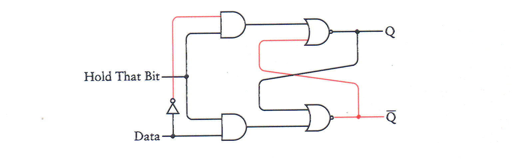

这个电路称为电平触发的D型触发器，D（D a t a）表示数据端输入。所谓电平触发是指当
保持位输入为某一特定电平（本例中为“ 1”）时，触发器才对数据端的输入值进行保存。（很
快，你将会看到另一种形式的触发器。）

通常情况下，当这样一个电路出现在书中时，输入并不被标为保持位，而是标为“时钟”。
当然，这个信号并不是一个真的时钟，但它有时却具有类似钟一样的属性，即在0和1之是有
规律地来回变化。

把数据端简写为D，时钟端简写为C l k，其功能表如下所示：

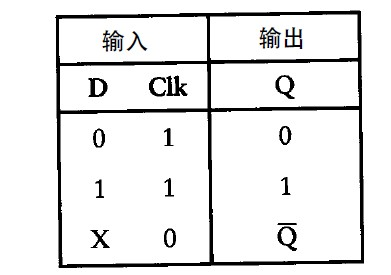

这个电路就是所谓的电平触发的D型锁存器，它表示电路锁存住一位数据并保持至将来使
用。它也可以称为1位存储器。本书将在第1 6章中说明如何将多个1位存储器连起来以构成多
位存储器。

利用锁存器可以实现多个二进制数字的相加运算。

8位锁存器：

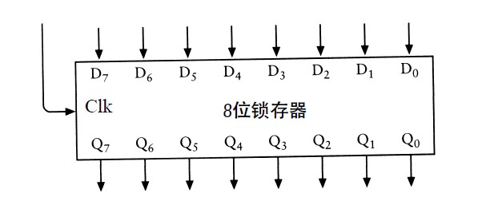

这个锁存器一次可以保存8位数。上面的8个输入标为D0～D7，下面的8个输出标为Q0～Q7。左
边的输入是时钟（ C l k），时钟信号通常为0。当时钟信号为1时，D端输入被送到Q端输出。当
时钟信号变为0时，8位输出值保持不变，直到时钟信号再次被置为1。8位锁存器也可以画成
下面的样子：

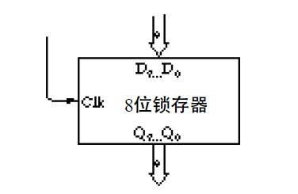

经修改， 8位加法器的输出既与灯泡相连，也作为8位锁存器的数据端( D )输入。标为“保
存”（S a v e）的开关是锁存器的时钟输入，用于保存加法器的运算结果：

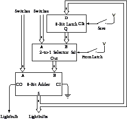

标识为2 - 1选择器的方块是让你用一个开关来选择加法器的B端输入是取自第2排开关还是
取自锁存器的Q端输出。当选择开关闭合时，就选择了用8位锁存器的输出作为B端输入。2 - 1
选择器用了8个如下电路：

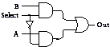

对加法机一个更好的改进方法是完全去掉一排开关，但是这需要先对D触发器做一点儿小
的改进，对它加一个或门和一个称为清零（C l e a r）的输入信号。清零信号通常为0，但当它为
1时，Q输出为0，如下图所示：

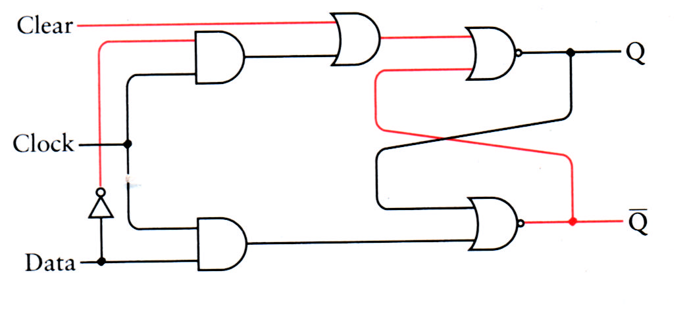

无论其他信号是什么，清零信号总迫使Q输出为0，起到了给触发器清零的作用。
下图中， 8个锁存器连着8
位加法器的输出：

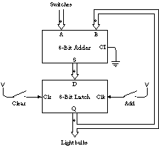

标识为“相加” ( A d d )的开关此刻控制着锁存器的时钟输入。

你可能会发现这个加法器比前面那个好用，尤其是当你需要加上一长串数字时。刚开始
时，按下清零开关，这个操作使锁存器输出为0，并熄灭了所有的灯泡，同时使加法器的B端
输入全为0。接着，通过开关输入第一个加数，闭合“相加”开关，则此加数反映在灯泡上。
再输入第二个数并再次闭合“相加”开关，由开关输入的8位操作数加到前面的结果上，其和
输出到灯泡。如此反复，可以连加很多数。

触发器是电平触发式的，意思是说只有在时钟端输入从0变到1后（即高电平时），数据端
输入的值才能保存在锁存器中。注意，在时钟端输入为1期间,数据端输入的任何改变都将反
应在Q或-Q端的输出值上。

对一些应用而言，电平触发时钟输入已经足够用了；但对另外一些应用来说，边沿触发
时钟输入更为适用。对于边沿触发器而言，只有当时钟从0变到1的瞬间，输出才会改变。在
电平触发器中，当时钟输入为0时，数据端输入的任何改变都不会影响输出；而在边沿触发器
中，当时钟输入为1时，数据端输入的改变也不会影响输出。只有在时钟输入从0变到1的瞬间，
数据端的输入才会影响边沿触发器的输出。

边沿触发的D型触发器是由两级R - S触发器按如下方式连接而成的：

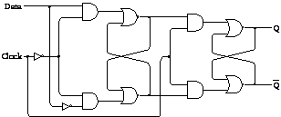;

把振荡器的输出连到边沿触发的D型触发器的时钟输入端，并把端输出连到自己的D输入端：

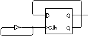

触发器的输出同时又是它自己的输入。（实际上，这种构造可能是有问题的。振荡器是由
来回迅速转变状态的继电器构成的。振荡器的输出和构成触发器的继电器相连，而这些继电
器不一定能跟上振荡器的速度。为了避免这些问题，这里假设振荡器中继电器的速度比这个
电路中其他地方的继电器的速度都慢。）

观察下面的功能表，就可以明白电路中发生的情况了。刚开始时， C l k输入和Q端输出都
是0，则 Q 端输出为1，而它和D输入是相连的：

当C l k输入从0变到1后，Q端输出就和D输入一样了：

但是因为－Q 端输出变为0，因而D输入也变为0。C l k输入现在是1：

当C l k信号变回为0时，不会影响输出：

现在C l k信号再变为1。由于D输入为0，则Q为0且－Q为1：

所以D输入也变为1：

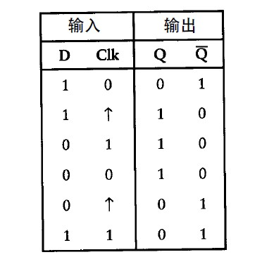

以上发生的情况总结起来就是：每当C l k输入从0变到1时，Q端输出就发生改变，或者从0
变到1，或者从1变到0。看看下面的图，问题就更清楚了：

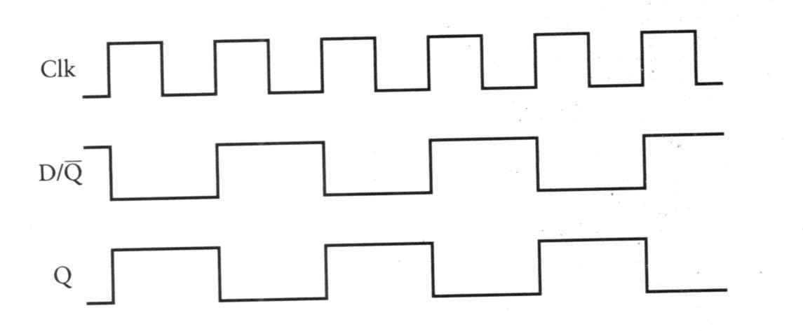

当C l k输入从0变到1时，D的值（与的值是相同的）被输出到Q端。当下一次C l k信号从
0变到1时，同样会改变D和的值。
若振荡器的频率是2 0赫兹（即每秒2 0次循环），则Q的输出频率是它的一半，即1 0赫兹。
由于这个原因，这种电路(其中输出依循触发器的数据端输入)称为分频器。
当然分频器的输出可以是另一个分频器的C l k输入，并再一次进行分频。下面是三个分频
器连在一起的情况：

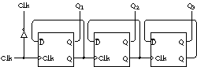

让我们来看一下上图顶部的4个信号的变化规律：

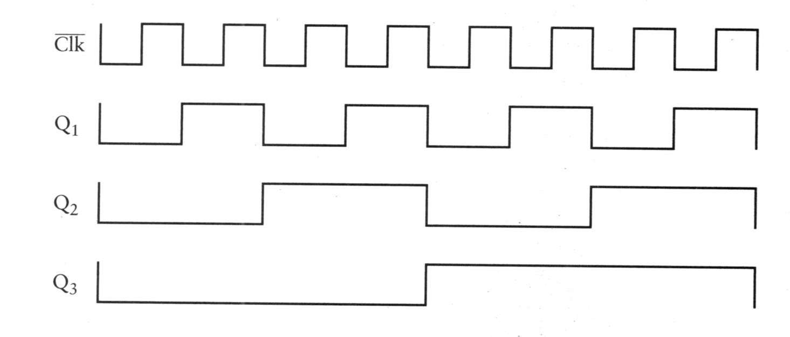

这里只给出了这幅图的一部分，因为这个电路会周而复始地变化下去。从这个图中，有
没有发现使你眼熟的东西？
提示你一下，把这些信号标上0和1：

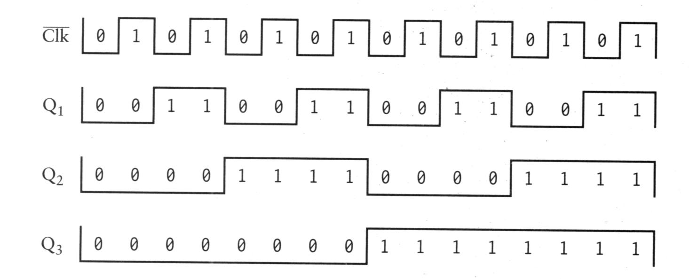

现在看出来了吗？把这个图顺时针旋转9 0度，读一读横向的4位数字，每一组输出都对应
了十进制中0～1 5中的一个数.

这个电路只具备了一个计数功能，如果再多加上几个触发器，它就可能计更多的数。第8
章曾指出在一个递增的二进制数序列中，每一列数字在0和1之间变化的频率是其右边那一列
数字变化频率的一半，这个计数器模仿了这一点。时钟信号每一次正跳变时，计数器的输出
就递加了1。

可以把8个触发器集成于一个盒子里，构成一个8位计数器：

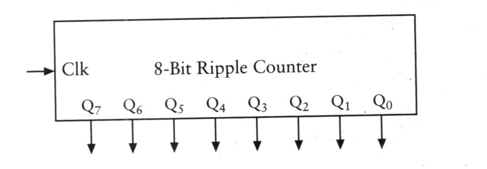

这个计数器称为8位行波（异步）计数器，因为每一个触发器的输出都成为下一个触发器
的时钟输入。变化是沿着触发器一级一级地传递的，最后一级触发器的变化必定要延迟一些。
更复杂的计数器是“并行（同步）计数器”，在这种计数器中，所有输出是同时改变的。
输出端信号已标识为从Q0～Q7，Q0是第一个触发器的输出。如果把灯泡连到这些输出上，
就可以把8位结果读出来。
这样一个计数器的时序图可以把8个输出分开来表示，也可以把它们一起表示，如下图所
示：

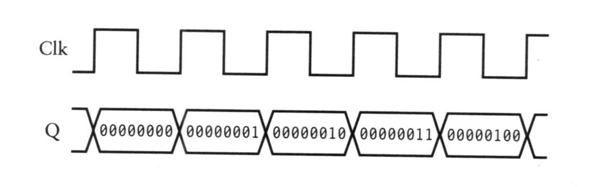

时钟信号的每个正跳变发生时，一些Q输出可能改变，另一些可能不改变，但总体上是使
8位行波计数量
原来的结果递增了1。
本章前面曾提到过可以找到某种方法来确定振荡器的频率，现在这个方法已经找到了。
如果把振荡器连到8位计数器的时钟输入上，计数器会显示出振荡器经历了多少次循环。当计
数器总和达到11111111时，它又会返回到0 0 0 0 0 0 0 0。使用计数器确定振荡器频率的最简单方
法是把计数器的输出连到8个灯泡上。当所有输出为0时（即没有一个灯泡点亮），启动一个秒
表；当所有灯泡都点亮时，停住秒表。这就是振荡器循环2 5 6次所需要的时间。假设是1 0秒钟，
则振荡器的频率就是2 5 6÷1 0，或者说是2 5 . 6赫兹。
